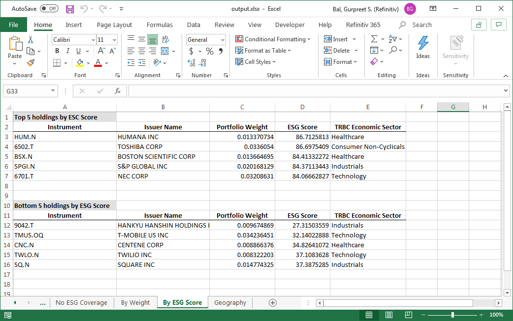
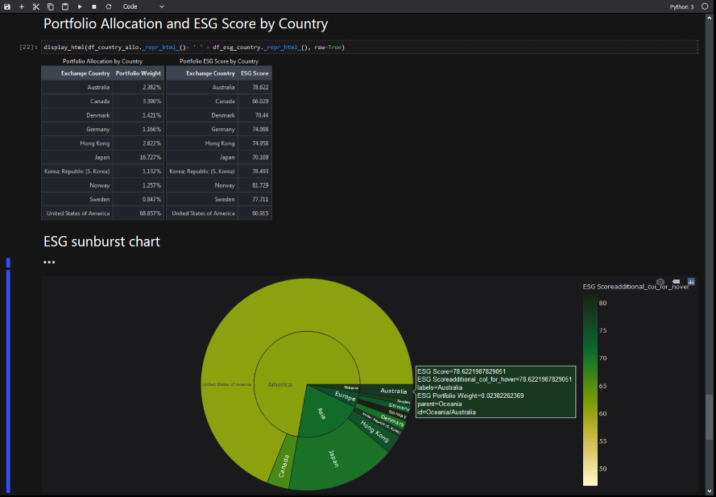

# Find out the ESG and Geographic exposure of a portfolio

## ESG matters more than ever
The past decade has seen surging demand for firms' environmental, social and governance (ESG) practices and disclosures, as investors grow increasingly looking to integrate ESG principles in their investment decisions. Overweighting or increasing portfolio exposure to a company with a low ESG score or Environmental pillar score in a portfolio could have a significant downside risk due to their environmental practices.

Regulatory guidelines also make it clear that we need to transition towards a greener and more sustainable economy. The European Commission's action plan towards financing sustainable growth was first put in place in March 2018 with its first action being the establishment of an EU classification system and requirements for sustainable activities.

You can mitigate those risks by leveraging Refinitiv's ESG content with in-depth coverage across 450+ ESG data points going back to 2002, covering 76 countries and 80% of global market capitalization. Our ESG content can be accessed over a number of different channels to suit your needs; via desktop applications and feeds.
 
## Understand and analyze your portfolio's ESG exposures
Our Portfolio Analytics desktop applications, [Eikon Data API](https://developers.refinitiv.com/en/api-catalog/eikon/eikon-data-api) and [Refinitiv Data Platform (RDP)](https://developers.refinitiv.com/en/api-catalog/refinitiv-data-platform/refinitiv-data-platform-apis) solutions will help you review and assess, your issuer level and portfolio's aggregate ESG exposures. These can be used to retrieve a list of instruments with or without ESG scores, your top and bottom holdings, as well as your top and bottom ESG rated instruments. In this article, we present two approaches to finding out the Geographic and ESG exposure of a portfolio. These two approaches are:

1. Use the Eikon Data API to do an exposure analysis of a single portfolio
2. Use the RDP RESTful API to batch process portfolios and find their exposure

## Code and description
Both the approaches to get the portfolio exposure, begin by requesting couple of financial and ESG metrices for every instrument in the portfolio. This initial request for data uses the python library from Refinitiv. There is a python library available for Eikon Desktop as well as the one for RDP REST API. These libraries simplify the task of logging in the user, auto management of logged in session, as well as easy high level API calls. Moreover, the output from the library is encapsulated in the [Pandas Dataframe](https://pandas.pydata.org/pandas-docs/stable/index.html), allowing for easy data manipulation.  

The metrics which are requested for portfolio constituents are:
1. The combined ESG score - *TR.TRESGScore*
2. Company's economic sector - *TR.TRBCEconomicSector*
3. The country and geographic region where it is located - *TR.ExchangeCountry* and *TR.ExchangeRegion*


**---@Agnes: why are these fields important to a portfolio manager---**


**Eikon:**

Eikon sample starts by loading the MSCI reference portfolio already built into Eikon and maintained by Refinitiv. A user has the ability to load their custom portfolio into Eikon as well. In addition, this code can be run in the Codebook - which is a Refinitiv hosted Jupyter environment in the cloud, allowing the user to skip all the local configuration on their machine.

It is important to note that Eikon data license does not allow a user to share the data with anyone else. Here is the key code snippet for getting all these data points from Eikon:

```python
portfolio = 'Portfolio(SAMPLE_GL_DEV)'
df, err = ek.get_data(portfolio, ['TR.PortfolioConstituentName','TR.PortfolioName','TR.PortfolioWeight','TR.TRESGScore', 'TR.TRBCEconomicSector','TR.ExchangeCountry','TR.ExchangeRegion'])
```

**RDP:**

The RDP variant of portfolio exposure sample is relevant, when a bunch of portfolios have to be batch processed and/or the analyzed portfolio has to be shared/distributed amongst other users. RDP offers an enterprise license which allows a user to share this data.
Moreover RDP is a server side API, which is more suited for building the enterprise application, capable of running on time/data triggers like saving a new portfolio.

In the RDP sample, we read the portfolio from one or more excel files. It is expected that excel spreadsheet will contain columns like Instrument (RIC identifier) and fractional number representing its weight in the portfolio. The code snippet to get the ESG and geographic data from RDP, after creating an RDP session is:

```python
endpoint = rdp.Endpoint(
  session = rdp.get_default_session(),
  url = "data/datagrid/beta1/")

instrs = inputdf['Instrument'].values.tolist()

response = endpoint.send_request(
  method = rdp.Endpoint.RequestMethod.POST,
  body_parameters = {
    "fields": [
      "TR.TRESGScore",
      "TR.TRBCEconomicSector",
      "TR.ExchangeCountry",
      "TR.ExchangeRegion"
    ],
    "universe": instrs
  }
)
```
A user's RDP account should have relevant permissions to invoke *datagrid* API calls.

### Common code steps

Once the data is retrieved in the step above, the result is available in the Pandas dataframe object with point data for all the instruments in the portfolio. The cells which do not have data are filled with *Null*, allowing us to get holdings with no ESG coverage. We show what portfolio percentage is made up of these holdings and then remove them from further analysis.

```python
df_esg_sum = df[df['ESG Score'].notna()].copy()
df_esg_sum = df_esg_sum['Portfolio Weight'].sum()
print('Number of holdings with ESG coverage: {:.2%}'.format(df_esg_sum))
```

Normalize the portfolio for ESG covered instruments and get top/bottom 5 holdings.

```python
df_esg_top = df_esg_port.nlargest(5,'ESG Score')
df_esg_top = df_esg_top[['Instrument','Issuer Name','Portfolio Weight','ESG Score','TRBC Economic Sector']]
df_esg_bottom = df_esg_port.nsmallest(5,'ESG Score')
df_esg_bottom = df_esg_bottom[['Instrument','Issuer Name','Portfolio Weight','ESG Score','TRBC Economic Sector']]
```

Sort the items by ESG region and country.
```python
df_esg_region = df_esg_port.groupby(['Exchange Region']).apply(wavg, 'ESG Score','ESG Portfolio Weight')
df_esg_region = df_esg_region.to_frame('ESG Score').reset_index()
df_esg_region['ESG Score'] = df_esg_region['ESG Score'].apply(lambda x: round(x, 3))
df_region_allo = df_esg_port.groupby(['Exchange Region'])['ESG Portfolio Weight'].sum()
df_region_allo = df_region_allo.to_frame('Portfolio Weight').reset_index()
df_region_allo['Portfolio Weight'] = pd.Series(["{0:.3f}%".format(val * 100) for val in df_region_allo['Portfolio Weight']], index = df_region_allo.index)

# ESG score by country
df_esg_country = df_esg_port.groupby(['Exchange Country']).apply(wavg, 'ESG Score','ESG Portfolio Weight')
df_esg_country = df_esg_country.to_frame('ESG Score').reset_index()
df_esg_country['ESG Score'] = df_esg_country['ESG Score'].apply(lambda x: round(x, 3))

# Portfolio Allocation by Country
df_country_allo = df_esg_port.groupby(['Exchange Country'])['ESG Portfolio Weight'].sum()
df_country_allo = df_country_allo.to_frame('Portfolio Weight').reset_index()
df_country_allo['Portfolio Weight'] = pd.Series(["{0:.3f}%".format(val * 100) for val in df_country_allo['Portfolio Weight']], index = df_country_allo.index)
```

In the Eikon notebook, all the resulting dataframes are displayed to the user. For the RDP workbook, each dataframe is inserted into an output spreadsheet as a new sheet. Which looks like this:




#### Run:
**Eikon:**   
Load the provided Jupyter notebook sample into Codebook and execute. Once run, the output looks like this:
	

	
	
**RDP:**   
You will need an account to invoke RDP API calls. See a [quickstart guide here](https://developers.refinitiv.com/en/api-catalog/refinitiv-data-platform/refinitiv-data-platform-apis/quick-start).

1. Install RDP Python library: ```pip install refinitiv-dataplatform```
2. Install the *openpyxl* in your environment: ```pip install openpyxl```
3. Run the sample from command line: 

```
>>> python RDP_sample1.py
Loading input portfolio...
   NaN Instrument  Issuer Name    Portfolio Name  Portfolio Weight
0    0    .ONECHF  Swiss Franc  GLOBAL DEVELOPED          0.000049
1    1    .ONEUKP    U K Pound  GLOBAL DEVELOPED          0.000049
2    2    .ONEUSD   U S Dollar  GLOBAL DEVELOPED          0.000049
3    3    .ONEEUR         Euro  GLOBAL DEVELOPED          0.000049
4    4     CSL.AX      CSL LTD  GLOBAL DEVELOPED          0.024179
Loggin into RDP...
Getting ESG data for portfolio...
  instrument  TR.TRESGScore TR.TRBCEconomicSector TR.ExchangeCountry TR.ExchangeRegion
0    .ONECHF            NaN                  None               None              None
1    .ONEUKP            NaN                  None               None              None
2    .ONEUSD            NaN                  None               None              None
3    .ONEEUR            NaN                  None               None              None
4     CSL.AX      79.404442            Healthcare          Australia           Oceania
Number of holdings with ESG coverage: 99.98%
Creating a new Excel spreadsheet...
Finished!
```
The sample reads the *InputPortfolio.xlsx* and creates an *output.xlsx* with analyzed content.

### Code:
Complete code for both Codebook as well as standalone RDP sample is available at:   
[Jupyter notebook for Codebook](https://github.com/Refinitiv-API-Samples/Article.EikonAPI.RDPLibrary.Python.PortfolioExposure/blob/master/Codebook_sample1.ipynb)   
[Python sample for RDP Libraries](https://github.com/Refinitiv-API-Samples/Article.EikonAPI.RDPLibrary.Python.PortfolioExposure/blob/master/RDP_sample1.py)   

